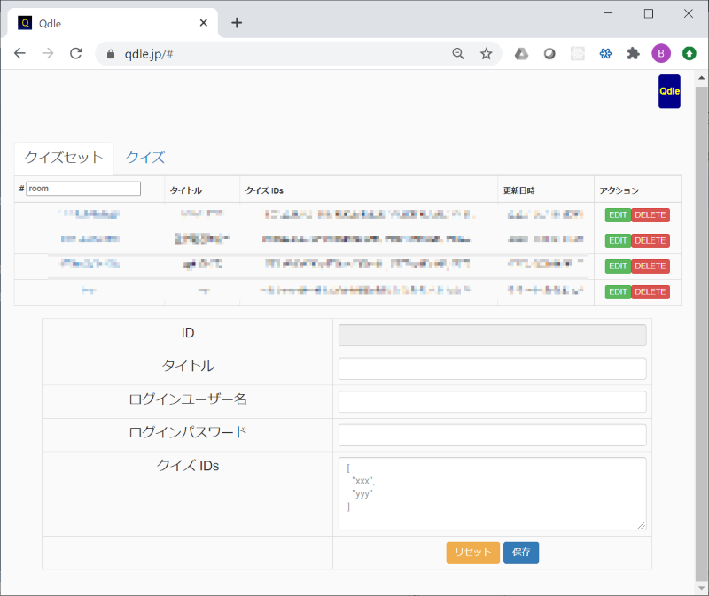
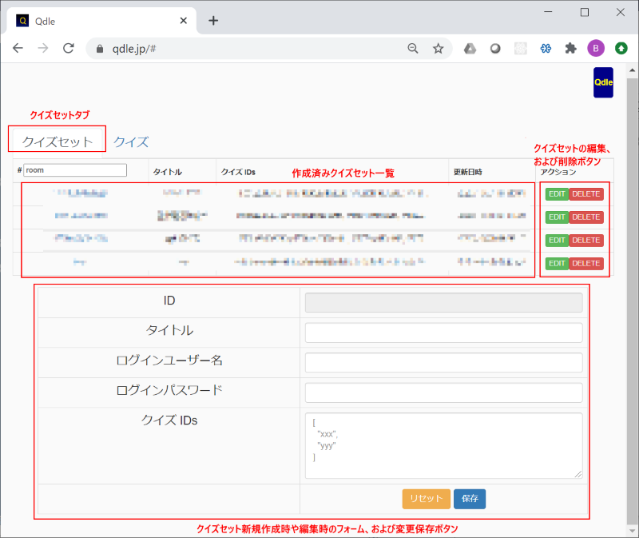
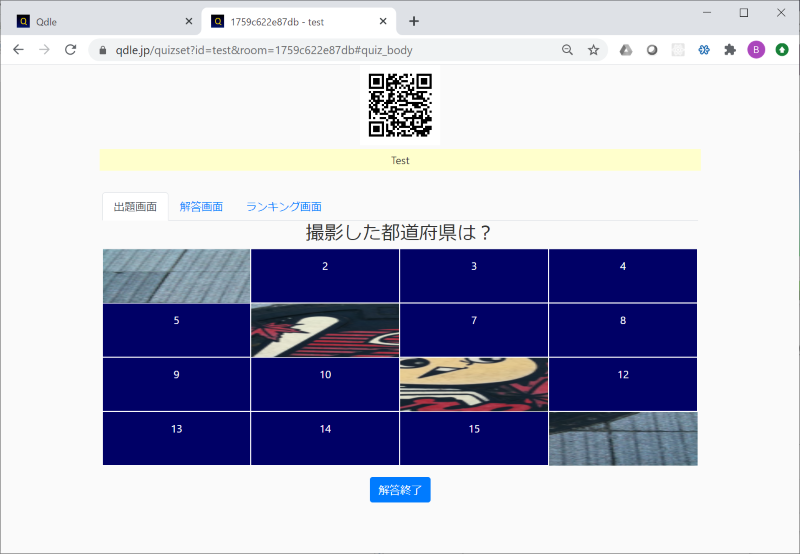

# （クイズ主催者向け）Qdle ユーザーガイド

## 目次

- **Qdle** とは

- クイズ主催に必要な準備事項

- Qdle へのサインイン

- 主催者画面のパーツ説明

- クイズ主催中の操作

- 編集方法

- 変更履歴

- Copyright

## Qdle とは

**Qdle** （読み方「キュードル」）は **オンライン・クイズプラットフォーム** です。一箇所に集まったり、オンライン会議を使ったりして、主催者のクイズ出題画面を見ながら、手元のスマートフォンを使ってクイズに解答することができます。スマートフォンの解答画面には指で文字や絵を描くことができたり、描く線や背景の色をカラフルに選ぶこともできるので、絵を描いて解答するクイズが出題されたり、解答を競う目的だけではなく、参加者全員で絵を描く時間を楽しむこともできます。

本資料は **Qdle** によってクイズ主催者として **クイズを提供** する人向けのユーザーガイドです。参加する人向けのユーザーガイドは [こちら](./USER_GUIDE_JA.md) を参照ください。

## クイズ主催に必要な準備事項

**Qdle** のクイズを主催するには以下の前提が必要です：

- インターネットに接続可能なパソコン

  - 仮に主催するクイズが同じ部屋に集まって、１つの画面をプロジェクター等に投影して行うような場合であってもインターネット接続が必要です。

  - （クイズがオンライン会議で提供される場合）オンライン会議を主催するためのアプリケーションがインストールされていること

## Qdle へのサインイン

- パソコンのウェブブラウザ（FireFox, または Chrome）で以下へアクセスします：

https://qdle.jp/

- 画面右上のボタンをクリックしてサインイン／サインアップ画面へ移動します：

- サインイン画面が表示されます。まだアカウントを持っていない場合は下部の **Sign up** と書かれたリンクをクリックし、ID（メールアドレス）とパスワードを登録してアカウントを取得します。アカウント取得済みであれば ID とパスワードを入力して **Sign in** します：

  - アカウント登録する際、First name （名）と Last name （性）を入力できます。Qdle ではサインイン後の名前として First name が先に表示されます。そのため名前を日本語で登録する場合は姓と名を逆にして入力するか、First name に姓と名をあわせて入力する（Last name は空）などしてください。

- サインイン後の画面に遷移します。右上に名前が表示され、ここをクリックするとサインアウトします。また同画面には自分のアカウントで作成済みのクイズやクイズセットの一覧が表示されますが、サインアップ直後はどちらも空なので何も表示されません（クイズやクイズセットの作成方法は後述）：

登録したメールアドレスにメールが届くので、24時間以内に確認リンクをクリックすることで正式な登録ができます。登録後はサインインが可能になります。

ここまでの作業でアカウントを作成してプラットフォームにサインインできました。

サインアウトする場合は右上の名前部分をクリックします。

- **注意**

  - **この状態になったら主催者が画面をリロードするのは控えて** ください。主催者画面をリロードすると WebSocket にリセットがかかり、参加済みの参加者の情報が失われてしまいます。

  - やむを得ず主催者画面をリロードする場合は、（もし他に主催者画面を同時に開いていた場合はまず全ての主催者画面をリロードして、）全参加者にも画面をリロードしてもらうよう指示してください。

## 主催者画面のパーツ説明

サインイン後の主催画面の各パーツを紹介します。まずはクイズセットタブが選択されている場合の画面とパーツはこちらです：

一方、クイズタブが選択されている場合の画面とパーツはこちらです：

## クイズ主催中の操作

自分でクイズやクイズセットを作成して操作することもできますが、まずは公開サンプルクイズセットを使って、クイズ大会を主催する際の操作に慣れておきましょう。

- Qdle にサインインしている状態からウェブブラウザで以下のページにアクセスします：

https://qdle.jp/quizset?id=test

  - 最終的には転送時に room パラメータが付与され、 `https://qdle.jp/quizset?id=test&room=XXXXXX` という URL が開きます。

  - **test** というタイトルの公開クイズセットを使ってクイズを主催／練習する画面が表示されます。

    - 画面上部に QR コードが表示されています

    - クイズが５問含まれているはずです。５問の内容は不定期に更新予定です。

    - クイズタイトル（test と表示されている部分）がクイズ表示／非表示のトグルになっています。１度クリックするとクイズは非表示になり、もう１度クリックすると再表示されます。

  - Qdle にサインインしていないと正しく表示されません

- （参加者のつもりで）スマートフォンでクイズにアクセスします

  - 今回は主催者用機能の操作方法を紹介していますが、全ての機能を確認するためクイズ参加者としてもアクセスしてみましょう

  - スマートフォンを取り出し、画面内の QR コードを読み取って参加者用 URL にアクセスします

  - Your name と書かれた箇所に自分のニックネームを入力して Start をタップします
  

  - キャンバス画面が表示されれば参加者としてのアクセスも成功ですo

  - 参加者が１名以上いる状態で、画面下部の解答画面タブを選択すると全参加者のニックネームと現在のキャンバスの様子が表示されます。

    - 参加者が増えるとこの画面も更新され、参加者が絵を更新するとこの画面も更新されます

    - 特定の参加者の絵をクリックするとその絵だけを拡大表示することができます

  - 試験的に１名だけクイズ大会に参加した状態で以下を行うことになります。参加者が１名だけだと解答画面が大きく表示されてしまいますが、３名以上が参加していると見栄えもそれほど悪くはなくなります。

- ５問あるクイズの中から１つ適当に選択します：

  - クイズにはカテゴリーが存在しており、各カテゴリーは以下のような形式で出題されます

    - 一般クイズ : 出題文（指定されている場合は画像も）が表示されるクイズです。解答に制限時間があります。

    - ズームアウト : 拡大されている画像が徐々にズームアウトされて全体像が見えるようになります。この画像を使って出題されるクイズです。なるべくズームアウトされる前に早く答えたほうが得点が高くなります。

    - 16分割 : 画像が4x4で16分割され、最初はすべてマスクされています。16枚のパネルを少しずつ外すことで少しずつ全体像が見えていくクイズです。なるべくマスクが残っている状態で早く答えたほうが得点が高くなります。

    - ぼかし : 最初はピントがあっていない状態で画像が表示されます。徐々にピントがあって鮮明になっていくクイズです。なるべく早く答えたほうが得点が高くなります。

    - サウンド : 音を聴いて解答するクイズです。

    - 動画 : 動画を観て解答するクイズです。

  - なお **早く答える** とは答を **書き終わった** タイミングで判断します。
  
    - 書き終わっても後から１筆書き加えたり、アンドゥやリセットをして書き直した場合は **書き直しの最後の１筆が書き終わったタイミング** で判断されます

  - 参加者は（制限時間がある場合は制限時間になる前に）答を推測してスマホ画面に指で解答します。

  - 主催者は制限時間を待つか、クイズ解答を終了（打ち切り）します。制限時間前に強制打ち切りをすることもできます。

    - 同時に出題画面下に正解や解説文章が表示されます。

      - 出題内容によってはここで別のブラウザに切り替えて解説ページを表示する、などしてもよいです。

    - 制限時間になるか、主催者がクイズ解答を打ち切った後に参加者がスマホに答を描いても主催者画面には反映されません。

  - クイズ終了後、解答画面タブを選択すると参加者全員の解答が表示されています。

    - 主催者が「正解」と判断した参加者については名前横の×印をクリックします。フレームが緑色に変わると「正解した」と判断されます。もう一度クリックすると緑が元の色に戻り「正解ではなかった」と判断されます。

    - 全員ぶんの採点が終わったらランキング画面を表示することもできます（必須ではないので、途中経過を見せたくない場合はそのまま次の問題へ移ってもかまいません）。ランキング画面タブを選択すると、参加者ごとの各問題への得点状況と現在の得点ランキングが上位から表示されます。

- 別のクイズを選択すると、次の問題の出題に移ります。

- クイズセットの全てのクイズを出題したら（あるいは途中でもクイズ大会を終了する場合は）最後の解答後に得点ランキングを表示することで成績上位者を表示することができます。

- 最後にわざと１問残しておくと、全問題出題後にも（その問題を選択することで）再度全員のお絵描きを共有することができるようになります。参加者全員による自画像での記念撮影などを撮る場合はこの方法を使ってください。

## 編集方法

自分でクイズを作ったり、作ったクイズを何題か１つにまとめてクイズセットを作ることも可能です。

### クイズを編集する

- サインイン直後の画面でクイズタブを選択します。現在までに作成したクイズの一覧が表示されます。

  - 一般ユーザーの場合、クイズは５題まで作成できます。有償ユーザーの場合、クイズ作成数に制限はありません。

  - 一度作ったクイズを書き換えたり、削除したり、実際に表示される画面を確認（プレビュー）することもできます。

### クイズセットを編集する

- サインイン直後の画面でクイズセットタブを選択します。現在までに作成したクイズセットの一覧が表示されます。

  - 一般ユーザーの場合、クイズセットは１題まで作成できます。有償ユーザーの場合、クイズセット作成数に制限はありません。

- クイズセットを作成する場合、サブジェクト（出題画面のトグル部分に表示されます）とクイズ IDs が必要です。クイズ IDs は自分または別の主催者が作成したクイズの ID を配列形式で指定します：

  - 例えば "001", "002", "003", "004", "005" という ID をもつクイズ５つをまとめてクイズセットを作る場合は以下のように指定します：

    - `[ "001", "002", "003", "004", "005" ]`

  - クイズの ID がわかっていれば、自分の作ったクイズを他の人のクイズセットに提供することも、他の人が作ったクイズを自分のクイズセットに組み込むこともできます。

    - ただし主催者と異なる人が作成したクイズを出題する場合は作成者の名前が出題画面に表示されます。

- 全て自分の作成したクイズからクイズセットを作る場合であれば、クイズ一覧画面の一覧表の左のチェックボタンにチェックを入れた状態で画面最下部の **クイズセット作成** ボタンを押すことでクイズセットを作ることもできます。

- クイズセット作成時の情報として **ログインユーザー名** と **ログインパスワード** を指定することもできます。

  - 作成したクイズセットの ID がわかっていれば、他の人のクイズセットを利用してクイズ大会を開催することもできます（上述の test も公開用のクイズセット ID です）。

  - クイズセットを公開はしてもいいが全員に使ってほしくない、という場合はこのログインユーザー名とログインパスワードを両方指定してクイズセットを作成してください。これらが指定されたクイズセットは起動時にユーザー名とパスワードを聞かれ、正しく入力できた場合だけクイズセットを利用することができるようになります。

### 自分が作成したクイズセットを使ってクイズ大会を開く

- 主催したいクイズセットを選択します。クイズセットタブを選択し、クイズセット一覧が表示されている中から主催したいクイズセットを選択して、ID 列（一番左の列）部分を選択します。

  - この方法でクイズセットを選択するとクイズ参加用の URL が自動生成されます。通知用などの目的でクイズ参加用の URL をあらかじめ確定させておくこともできます。その場合は表左上の #room と書かれている部分に適当な一意の文字列を指定してから目的のクイズセットの ID 列を選択します。

  - この場合のクイズ参加用 URL は以下になります：

    - https://qdle.jp/client?id=(ID列の値)&room=(指定したroomの値)

      - room を指定しないで ID 列を選択した場合、room=XXXXXX の XXXXXX 部分がランダムに生成されます

      - 実行中のクイズセットにアクセスするための URL はスマートフォンからであれば QR コードリーダーで読み取り可能です。PC 向けには QR コードが表示されている部分をクリックすると、URL がクリップボードにコピーされるので、メールやメッセンジャーで対象の相手にその URL を送って知らせることができます。

- クイズセットが起動すると以下のようなウィンドウが表示されます：

  - この画面をプロジェクターで投影するか、オンライン会議で画面共有してクイズを開催します：

  - スマートフォンで参加する人へ向けて、「画面上の QR コードをスマートフォンの QR コードリーダーで撮影し、Your name と表示されている部分に自分のニックネームを入力して Start してください」とガイドしてください。

### 自分が作成していないクイズセットを使ってクイズ大会を開く

- クイズ大会を開きたいクイズセットの ID を教えてもらいます。

- Qdle プラットフォームにサインイン後、以下の URL をブラウザで開きます：

https://qdle.jp/quizset?id=(教えてもらったクイズセットID)

- room パラメータが付与された URL へリダイレクトされ、指定されたクイズセットのウィンドウが開きます。

## 変更履歴

- 2020.11.06 : v0.0.4 をベースに記載

## Copyright

2020 [K.Kimura @ Juge.Me](https://github.com/dotnsf) all rights reserved.
