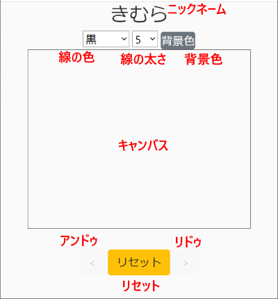

# （クイズ参加者向け）Qdle ユーザーガイド

## 目次

- **Qdle** とは

- クイズ参加に必要な準備事項

- クイズ参加方法

- クイズ参加中の操作

- 変更履歴

- Copyright

## Qdle とは

**Qdle** （読み方「キュードル」）は **オンライン・クイズプラットフォーム** です。一箇所に集まったり、オンライン会議を使ったりして、主催者のクイズ出題画面を見ながら、手元のスマートフォンを使ってクイズに解答することができます。スマートフォンの解答画面には指で文字や絵を描くことができたり、描く線や背景の色をカラフルに選ぶこともできるので、絵を描いて解答するクイズが出題されたり、解答を競う目的だけではなく、参加者全員で絵を描く時間を楽しむこともできます。

本資料は **Qdle** によってクイズ主催者から提供されるクイズに **参加** する人向けのユーザーガイドです。主催する人向けのユーザーガイドは [こちら](./ADMIN_GUIDE_JA.md) を参照ください。

## クイズ参加に必要な準備事項

**Qdle** のクイズに参加するには以下の前提が必要です：

- インターネットに接続可能で、QR コードの読み取りが可能なスマートフォン

- （クイズがオンライン会議で提供される場合）クイズ主催者のオンライン会議に参加するためのアプリケーションがインストールされた、インターネットに接続可能なパソコン

まずスマートフォンは **必須** です。Qdle ではスマートフォンが解答用ボードとなり、スマートフォンの画面に直接指で答を（文字や絵で）描いて解答します。

またクイズが（一箇所に集まって、クイズ主催画面をプロジェクターに写したりするのではなく）オンライン会議を使って提供される場合は、上記スマートフォンとは別にオンライン会議を見るためのパソコンおよびオンライン会議アプリケーションが必要です。

以上が推奨環境です。以下は非推奨環境ですが、これら非推奨環境で参加される場合は（クイズ参加する上で不利にもなりうるような）制限次項を理解した上でご利用ください。

- スマートフォンではなく、パソコンの画面を使ってクイズに解答することもできます。ただしその場合はパソコン用の参加 URL を主催者から提供してもらう必要があります。加えてスマートフォンとは異なり、マウスやタッチパッドを使って文字や絵を描く必要があるため、操作性の面でかなり不利になります。

- パソコンの代わりにスマートフォンまたはタブレットを使ってオンライン会議に参加することも可能です。ただしクイズ出題画面が小さく表示されることが避けられないため、場合によっては正しい出題内容を読み取れなくなったり、パソコンから参加している人と比べて不利になることが考えられます。

## クイズ参加方法

- スマートフォンでクイズに参加する場合は、クイズ主催者の画面の最上部に表示されている **QRコード** をスマートフォンで読み取り、その URL へアクセスします。すると以下のような画面が表示されます：

- この画面にはテキストフィールドが２行ありますが、上にあるテキストフィールド（図では 1759751e3749e と入力されているフィールド）の値は変更しないでください。　下にあるテキストフィールド（図では Your name ... と表示されているフィールド）をタップし、**自分の名前** を入力して **Start** をタップするとクイズに参加できます。

  - なお、ここで入力する名前は主催者の解答一覧画面や成績表画面で表示される名前となります。本名である必要はありませんが、自分で見て自分であることがわかるニックネーム等を入力してください。

- 以下のような解答画面が表示されれば参加完了です（最上部の「きむら」は入力したニックネームが表示されています）：

## クイズ参加中の操作

- 表示された解答画面の各部分とその機能は以下の通りです：

  - ニックネーム : 参加時に入力したニックネームが表示されています

  - 線の色 : 指で描く線の色を選択できます

  - 線の太さ : 指で描く線の太さを選択できます

  - 背景色 : キャンバスの背景色を選択できます

  - キャンバス : ここに指をなぞって絵や文字を描きます

  - アンドゥ : １回のストロークぶんやり直します

  - リセット : キャンバスを初期状態に戻します

  - リドゥ : アンドゥのアンドゥ（アンドゥをやり直します）

- これらのパーツを使ってキャンバス内に指で絵や文字を描くことができます。下の例のように、ここに絵や文字を描いてクイズの解答を入力します：

- 描いた絵や文字は主催者画面にそのまま送信されます。特に送信ボタン等はありません。

  - 解答を描いた後に書き加えてしまったり、リセットを押したりすると変化した内容が主催者画面に送信されてしまいます。ご注意ください。

  - クイズによっては解答に制限時間が設定されているものがあります。また制限時間の有無に関係なく、主催者はクイズの解答を打ち切ることもできます。そうなった後は手元の絵を変更することはできますが、変更内容は主催者には送信されません（制限時間か、打ち切られる直前に送られた内容が主催画面に表示されます）

- クイズは多くの場合、複数問用意されています。１つのクイズが終了して、次のクイズが始まると再び描いた絵や文字が主催者画面に送信されるようになります。いったんリセットしてから答を書き直してください。

- 誤操作によって画面が拡大されたり、絵の描画を受け付けなくなったりすることがあります。その場合はキャンバス内をダブルタップしたり、キャンバス外をダブルタップして拡大を解除できるかどうか試してみてください。　それでも変わらない場合は画面をリロードしてみてください。

## 変更履歴

- 2020.11.06 : v0.0.4 をベースに記載

## Copyright

2020 [K.Kimura @ Juge.Me](https://github.com/dotnsf) all rights reserved.
